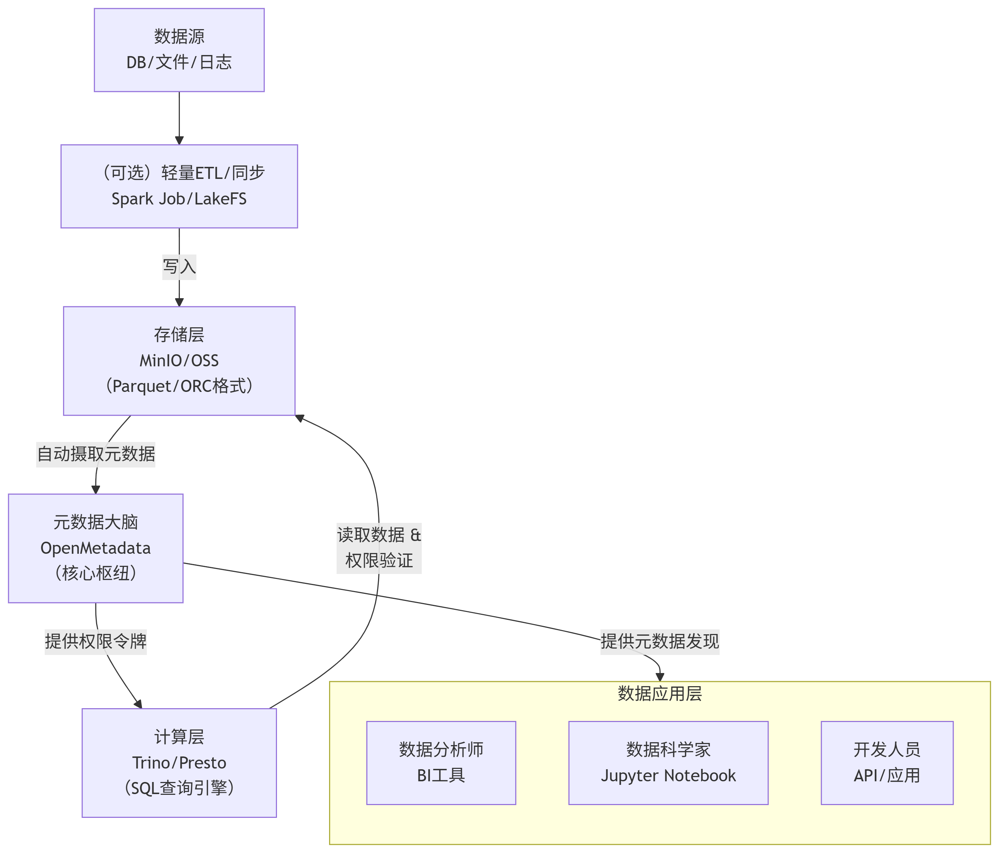

# 轻量级数据湖架构 (alinesno-infra-data-lake-adapter)

参考建设[阿里云数据湖](https://help.aliyun.com/zh/dlf/?spm=a2c4g.11186623.0.0.23a22d44uNgj7d)
部署Trino:[Trino](https://blog.csdn.net/u013008898/article/details/129904695)

## 概述

本项目旨在构建一个现代化、轻量级且功能完备的数据湖平台。该架构以 **对象存储** 为基石，以 **开源元数据框架** 为大脑，以 **轻量计算引擎** 为手脚，实现了存储与计算分离，兼顾了弹性、成本与性能。

**核心设计理念**：
- **轻量敏捷**：避免沉重的Hadoop生态依赖，采用云原生组件，易于部署和维护。
- **成本效益**：利用对象存储的低成本特性存储海量数据，计算资源按需启停。
- **功能完备**：通过核心组件组合，提供数据管理、目录发现、SQL查询与权限控制等企业级功能。

## 架构图

 *(注：请将架构图文件放入 `docs/images/` 目录下)*

该架构清晰地展示了数据从接入到消费的流程：
1.  **数据源**（数据库、应用、文件）通过CDC或批处理工具接入。
2.  **存储层**（MinIO/OSS）作为统一存储底座，存放原始、加工和模型数据。
3.  **元数据层**（Iceberg, OpenMetadata）作为大脑，管理技术和业务元数据。
4.  **计算层**（Trino）作为手脚，提供强大的即席查询能力。
5.  **应用层**（BI、Notebook、应用）通过统一接口消费数据。

## 核心技术栈

| 层级 | 组件             | 版本     | 说明 |
| :--- |:---------------|:-------| :--- |
| **存储层** | MinIO          | Latest | 高性能、S3兼容的开源对象存储，用于存储所有数据文件。 |
| | 或 七牛云 Kodo     | -      | 公有云S3兼容对象存储，可作为生产环境选择。 |
| **元数据管理层** | Apache Iceberg | 1.3.0  | **核心表格式**。管理数据文件、元数据 manifest，提供 ACID 事务、时间旅行等功能。 |
| | PostgreSQL          | 16     | 作为 Iceberg JDBC Catalog 的后端存储数据库。 |
| **计算与查询层** | Trino          | 420+   | 高性能分布式 SQL 查询引擎，用于查询 Iceberg 表和数据探索。 |
| **安全与权限** | Trino ACL      | -      | 实现查询级别的库、表、列权限控制。 |

- 将非结构化数据（如图片、文档）存储在七牛云
- 将结构化或半结构化数据存储在 Iceberg 数据湖
- 所有文件的元数据统一存储在 MySQL 中，便于管理和查询

## 项目结构

```
lightweight-datalake/
├── docs/                       # 项目文档
│   └── images/                 # 架构图、流程图等
├── scripts/                    # 部署和维护脚本
│   ├── deploy/                 # 各类组件的部署脚本（Docker, K8s）
│   └── maintenance/            # 日常维护脚本
├── sql/                        # SQL脚本目录
│   ├── iceberg/                # Iceberg表DDL初始化脚本
│   └── trino/                  # Trino视图、函数等脚本
├── sample-data/                # 用于测试的示例数据
└── README.md                   # 本项目说明文档
```

## 快速开始

### 1. 前提条件

- Docker & Docker Compose (用于本地开发环境部署)
- JDK 11+ (用于运行Trino, Spark作业等)
- PostgreSQL 14+

### 2. 本地开发环境部署

1.  **启动 MinIO**:
    ```bash
    docker run -p 9000:9000 -p 9090:9090 \
      --name minio \
      -e "MINIO_ROOT_USER=minioadmin" \
      -e "MINIO_ROOT_PASSWORD=minioadmin" \
      minio/minio server /data --console-address ":9090"
    ```
    访问 `http://localhost:9090` 登录管理控制台，创建名为 `datalake` 的 bucket。

2.  **启动 PostgreSQL**:
    ```bash
    docker run --name postgres \
      -e POSTGRES_DB=metastore \
      -e POSTGRES_USER=iceberg \
      -e POSTGRES_PASSWORD=password \
      -p 5432:5432 -d postgres:14
    ```

3.  **配置并启动 Trino**:
    参考 `scripts/deploy/trino` 目录下的配置示例，配置 `etc/catalog/iceberg.properties` 和 `etc/catalog/minio.properties`，然后使用 Docker 启动。
    ```bash
    # 示例配置
    connector.name=iceberg
    hive.metastore.uri=thrift://localhost:9083
    warehouse=s3a://datalake/warehouse/
    s3.aws.credentials.provider=com.amazonaws.auth.DefaultAWSCredentialsProviderChain
    s3.endpoint=http://minio:9000
    s3.path-style-access=true
    ```

4.  **(可选) 启动 OpenMetadata**:
    ```bash
    # 使用官方docker-compose快速启动
    curl https://raw.githubusercontent.com/open-metadata/OpenMetadata/main/docker/run-local-docker.sh | bash
    ```

### 3. 创建你的第一张Iceberg表

通过Trino CLI或JDBC连接至Trino Coordinator，执行以下SQL：

```sql
-- 创建Catalog（通常已在配置中定义）
-- USE iceberg.default;

-- 创建Iceberg表
CREATE TABLE iceberg.dwd.sample_users (
    id bigint,
    name varchar,
    email varchar,
    signup_date date
)
WITH (
    format = 'PARQUET',
    partitioning = ARRAY['signup_date'],
    location = 's3a://datalake/dwd/sample_users/'
);

-- 插入数据
INSERT INTO iceberg.dwd.sample_users
VALUES
(1, 'Alice', 'alice@example.com', CURRENT_DATE),
(2, 'Bob', 'bob@example.com', CURRENT_DATE);

-- 查询数据
SELECT * FROM iceberg.dwd.sample_users;
```

## 数据分层设计

数据在湖内遵循以下分层结构，存储在对应的MinIO路径下：

-   `s3a://datalake/raw/`：**原始数据层**。存储未经处理的原始数据，如CDC流、日志文件、原始备份。
-   `s3a://datalake/dwd/`：**明细数据层**。对原始数据进行清洗、整合、规范化后的细粒度数据事实表。
-   `s3a://datalake/dws/`：**汇总数据层**。按主题域聚合的轻度汇总数据，服务于具体业务场景。
-   `s3a://datalake/ads/`：**应用数据层**。为特定报表或应用高度聚合的数据。
-   `s3a://datalake/warehouse/`：**Iceberg元数据仓库**。由Iceberg管理其元数据文件。

## 运维与管理

-   **监控**：配置Prometheus/Grafana监控Trino集群、MinIO存储状态。
-   **元数据备份**：定期备份PostgreSQL中的Iceberg Catalog和OpenMetadata数据库。
-   **数据生命周期**：编写脚本定期清理或归档MinIO中的冷数据。
-   **用户权限**：通过OpenMetadata UI和Trino配置文件管理用户与权限。

## 常见问题 (FAQ)

1.  **Q: 为什么选择Iceberg而不是Hive Metastore？**
    **A:** Iceberg提供更强大的表格式功能（ACID、时间旅行、隐藏分区），且无需单独维护HMS服务，更轻量。

2.  **Q: 如何同步MySQL数据到湖里？**
    **A:** 推荐使用CDC工具如Debezium + Kafka Connect，或Flink CDC，将数据写入Iceberg表对应的MinIO路径。

3.  **Q: 如何保证数据安全？**
    **A:** 组合使用MinIO的Bucket Policy、Trino的SQL权限控制、OpenMetadata的数据策略，并在网络层面使用VPC和SSL加密。

## 贡献指南

欢迎提交 Issue 和 Pull Request！
1.  Fork 本仓库。
2.  创建您的特性分支 (`git checkout -b feature/AmazingFeature`)。
3.  提交您的更改 (`git commit -m 'Add some AmazingFeature'`)。
4.  推送到分支 (`git push origin feature/AmazingFeature`)。
5.  开启一个 Pull Request。

## 许可证

本项目采用 Apache License 2.0 开源许可证。详情请见 [LICENSE](LICENSE) 文件。

## 了解更多

-   [Apache Iceberg 官方文档](https://iceberg.apache.org/)
-   [Trino 官方文档](https://trino.io/docs/current/)
-   [MinIO 官方文档](https://min.io/docs/minio/linux/index.html)
-   [OpenMetadata 官方文档](https://docs.open-metadata.org/)

---

**如有问题，请先查阅文档和代码注释。如果问题仍未解决，请提交Issue。**

## 其它资料
https://blog.csdn.net/TR_0323/article/details/119318970
https://juejin.cn/post/7232689996821692473

