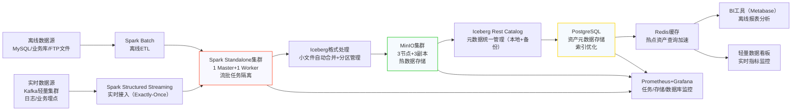
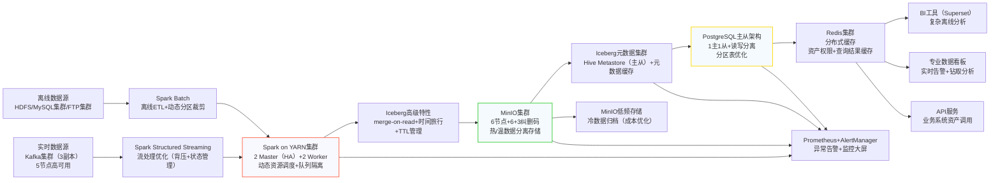
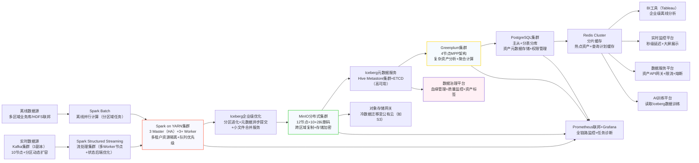

# 数据湖整体架构图

### 一、中小型架构流程图（TB级离线+1万条/秒实时）

 *(注：请将架构图文件放入 `docs/images/` 目录下)*

### 二、中大型架构流程图（PB级离线+10万条/秒实时）

 *(注：请将架构图文件放入 `docs/images/` 目录下)*

### 三、超大型架构流程图（10PB+离线+50万条/秒实时）

 *(注：请将架构图文件放入 `docs/images/` 目录下)*

### 核心调整说明（仅Spark流批一体）
1. **计算层强化Spark能力**：
    - 中小型用`Spark Standalone`，中大型/超大型升级为`Spark on YARN`（支持动态资源调度和高可用）。
    - 实时处理依赖`Spark Structured Streaming`的高级特性：背压机制、状态管理（ RocksDB 状态后端）、Exactly-Once语义，无需引入Flink。

2. **存储与资产层适配**：
    - 随数据量增长，MinIO从3节点扩展到12+节点，引入纠删码和冷热分离；Iceberg元数据从单机Rest Catalog升级为Hive Metastore集群。
    - 资产层从单PostgreSQL逐步升级为主从架构→分表分库→结合Greenplum（支撑复杂分析），满足不同规模的查询需求。

3. **运维与治理增强**：
    - 超大型架构增加数据治理平台，管理资产血缘、质量和标签，适配企业级数据资产管理需求。
